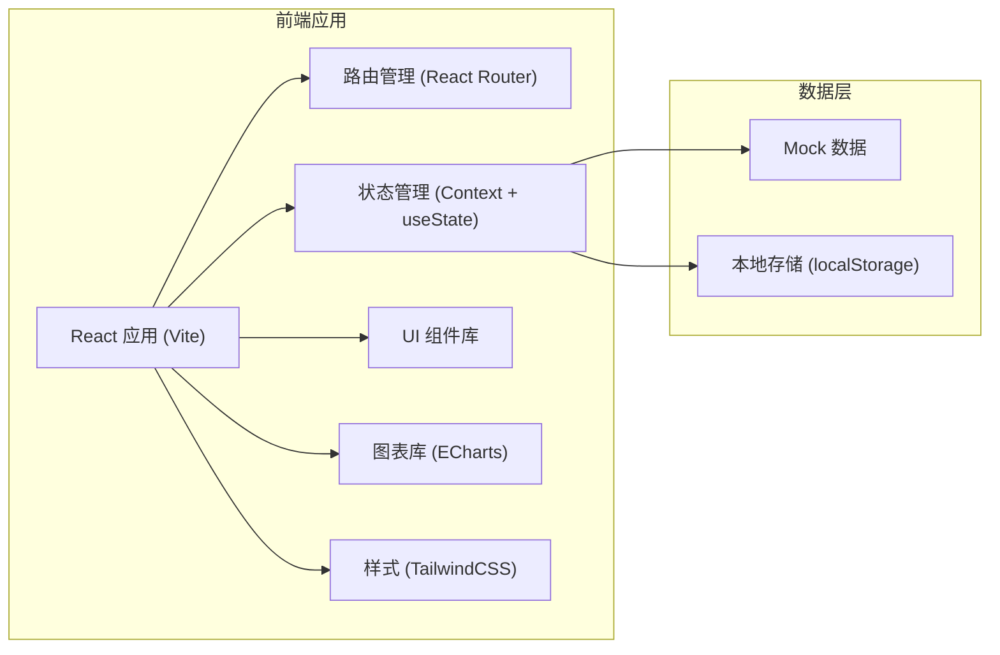

## 1. 架构设计



## 2. 技术描述

- **前端框架**：React 18 + TypeScript
- **构建工具**：Vite 5
- **路由管理**：React Router v6
- **样式方案**：TailwindCSS 3
- **图表库**：ECharts 5
- **图标库**：Lucide React
- **状态管理**：React Context + useReducer
- **数据来源**：Mock 数据（前端模拟）
- **本地存储**：localStorage（收藏、设置持久化）

## 3. 目录结构

```
src/
├── components/          # 公共组件
│   ├── Layout/         # 布局组件
│   │   ├── Sidebar.tsx
│   │   ├── Header.tsx
│   │   └── index.tsx
│   ├── Card/           # 卡片组件
│   ├── Chart/          # 图表组件
│   ├── Table/          # 表格组件
│   └── Modal/          # 弹窗组件
├── pages/              # 页面组件
│   ├── Dashboard/      # 总览大盘
│   ├── Topology/       # 服务拓扑
│   ├── Alerts/         # 告警列表
│   ├── Metrics/        # 指标趋势
│   ├── DutyCalendar/   # 值班日历
│   ├── EventTimeline/  # 事件时间线
│   ├── Postmortem/     # 复盘报告
│   └── Settings/       # 规则设置
├── data/               # Mock 数据
│   ├── services.ts
│   ├── alerts.ts
│   ├── metrics.ts
│   └── duty.ts
├── types/              # TypeScript 类型定义
│   └── index.ts
├── hooks/              # 自定义 Hooks
│   ├── useAlerts.ts
│   ├── useServices.ts
│   └── useMetrics.ts
├── context/            # Context 状态管理
│   └── AppContext.tsx
├── utils/              # 工具函数
│   ├── date.ts
│   └── format.ts
├── App.tsx
├── main.tsx
└── index.css
```

## 4. 路由定义

| 路由路径 | 页面名称 | 说明 |
|----------|----------|------|
| /dashboard | 总览大盘 | 首页，展示核心指标概览 |
| /topology | 服务拓扑 | 服务调用关系拓扑图 |
| /alerts | 告警列表 | 告警管理列表 |
| /metrics | 指标趋势 | 指标趋势图表 |
| /duty | 值班日历 | 值班排班日历 |
| /timeline | 事件时间线 | 事故时间线回放 |
| /postmortem | 复盘报告 | 复盘报告列表 |
| /settings | 规则设置 | 系统规则配置 |

## 5. 核心数据模型

### 5.1 服务 (Service)

```typescript
interface Service {
  id: string;
  name: string;
  system: string;
  status: 'healthy' | 'warning' | 'critical' | 'offline';
  availability: number;
  avgResponseTime: number;
  errorRate: number;
  qps: number;
  isFavorite: boolean;
  dependencies: string[];
  dependents: string[];
}
```

### 5.2 告警 (Alert)

```typescript
interface Alert {
  id: string;
  ruleId: string;
  ruleName: string;
  serviceId: string;
  serviceName: string;
  level: 'critical' | 'warning' | 'info';
  status: 'pending' | 'acknowledged' | 'closed';
  message: string;
  count: number;
  firstTriggered: Date;
  lastTriggered: Date;
  acknowledgedBy?: string;
  acknowledgedAt?: Date;
  closedBy?: string;
  closedAt?: Date;
  notes: AlertNote[];
}

interface AlertNote {
  id: string;
  content: string;
  author: string;
  createdAt: Date;
}
```

### 5.3 指标数据 (MetricData)

```typescript
interface MetricDataPoint {
  timestamp: number;
  value: number;
}

interface MetricData {
  serviceId: string;
  metric: 'responseTime' | 'errorRate' | 'qps' | 'availability';
  data: MetricDataPoint[];
}
```

### 5.4 值班 (Duty)

```typescript
interface DutyRecord {
  date: string;
  shift: 'morning' | 'afternoon' | 'night';
  person: DutyPerson;
  handover?: string;
}

interface DutyPerson {
  id: string;
  name: string;
  phone: string;
  email: string;
  avatar: string;
}
```

### 5.5 事件 (Event)

```typescript
interface Event {
  id: string;
  timestamp: Date;
  type: 'alert' | 'action' | 'deployment' | 'resolution';
  title: string;
  description: string;
  serviceIds: string[];
  author?: string;
}

interface Incident {
  id: string;
  title: string;
  startTime: Date;
  endTime?: Date;
  status: 'ongoing' | 'resolved';
  severity: 'critical' | 'major' | 'minor';
  affectedServices: string[];
  events: Event[];
  impactScope: string;
}
```

### 5.6 复盘报告 (Postmortem)

```typescript
interface PostmortemReport {
  id: string;
  incidentId: string;
  title: string;
  createdAt: Date;
  updatedAt: Date;
  status: 'draft' | 'published';
  content: {
    summary: string;
    timeline: string;
    rootCause: string;
    impact: string;
    actionItems: ActionItem[];
    lessonsLearned: string;
  };
}

interface ActionItem {
  id: string;
  description: string;
  owner: string;
  dueDate: Date;
  status: 'pending' | 'in-progress' | 'completed';
}
```

### 5.7 规则配置 (Settings)

```typescript
interface AlertRule {
  id: string;
  name: string;
  metric: string;
  condition: 'gt' | 'lt' | 'eq';
  threshold: number;
  duration: number;
  level: 'critical' | 'warning' | 'info';
  enabled: boolean;
  serviceIds: string[];
}

interface SilenceRule {
  id: string;
  name: string;
  startTime: string;
  endTime: string;
  daysOfWeek: number[];
  enabled: boolean;
  alertRuleIds: string[];
}

interface EscalationRule {
  id: string;
  name: string;
  alertLevel: 'critical' | 'warning';
  waitTime: number;
  notifyTo: string[];
  channel: 'email' | 'sms' | 'phone';
  enabled: boolean;
}
```

## 6. 核心状态管理

使用 React Context 管理全局状态：

- 服务列表及状态
- 当前告警列表
- 用户收藏的服务
- 系统设置配置
- 当前选中的时间范围

## 7. 性能优化

- 图表组件使用 React.memo 避免不必要重渲染
- 大数据量表格使用虚拟滚动
- 拓扑图使用 Canvas/SVG 混合渲染
- 路由懒加载减少首屏体积
- 防抖节流处理高频交互
