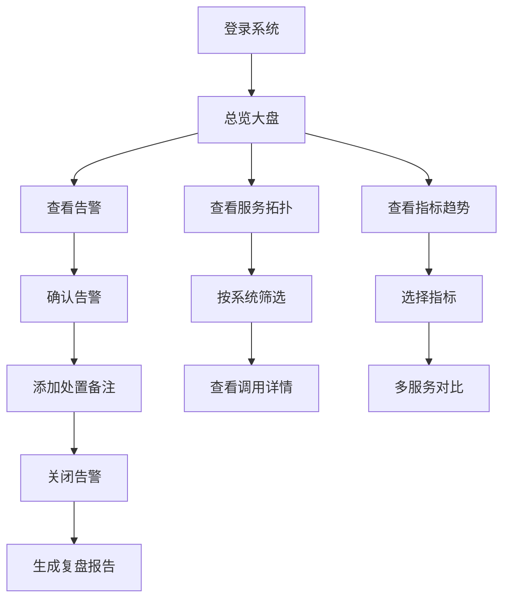

## 1. 产品概述

运维监控 Web 控制台是为平台负责人设计的一站式运维管理平台，集成服务健康监控、告警管理、事故复盘和值班调度等核心功能，帮助运维团队高效保障系统稳定性。

- 核心目标：提供全面的服务健康可视化、快速的告警响应机制、规范的事故复盘流程
- 目标用户：平台负责人、运维工程师、SRE 团队、技术管理人员

## 2. 核心功能

### 2.1 用户角色

| 角色 | 登录方式 | 核心权限 |
|------|----------|----------|
| 平台负责人 | 账号登录 | 查看所有数据、配置规则、导出报告 |
| 运维工程师 | 账号登录 | 处理告警、查看拓扑、值班管理 |
| 访客 | 只读账号 | 查看大盘和告警列表 |

### 2.2 功能模块

1. **总览大盘**：服务可用率总览、核心指标卡片、告警概览、重点服务收藏
2. **服务拓扑**：服务调用关系图、按系统筛选、调用链详情、响应时间/错误率展示
3. **告警列表**：告警分级展示、重复告警合并、确认/关闭告警、处置备注、告警频次统计
4. **指标趋势**：响应时间趋势、错误率趋势、流量趋势、多维度筛选对比
5. **值班日历**：值班排班展示、值班人员关联、值班交接记录
6. **事件时间线**：事故时间线回放、影响范围标记、事件节点详情
7. **复盘报告**：复盘模板生成、事故详情记录、月度稳定性报告导出
8. **规则设置**：告警规则配置、静默时段设置、升级通知配置、收藏管理

### 2.3 页面详情

| 页面名称 | 模块名称 | 功能描述 |
|----------|----------|----------|
| 总览大盘 | 指标概览卡片 | 展示整体可用率、告警数、服务数、今日事故数 |
| 总览大盘 | 可用率趋势 | 近30天服务可用率折线图 |
| 总览大盘 | 告警分布 | 按级别统计告警数量的环形图 |
| 总览大盘 | 重点服务 | 收藏的重点服务状态列表 |
| 总览大盘 | 最新告警 | 最近产生的告警列表 |
| 服务拓扑 | 拓扑图 | 可缩放拖拽的服务调用关系图 |
| 服务拓扑 | 系统筛选 | 按业务系统筛选展示服务 |
| 服务拓扑 | 调用详情 | 点击连线展示调用量、响应时间、错误率 |
| 服务拓扑 | 服务详情 | 点击节点展示服务详情面板 |
| 告警列表 | 告警表格 | 分页展示所有告警，支持按级别/状态/时间筛选 |
| 告警列表 | 合并告警 | 相同规则重复告警自动合并，展示次数 |
| 告警列表 | 告警操作 | 确认告警、关闭告警、添加处置备注 |
| 告警列表 | 频次统计 | 告警产生频次趋势图 |
| 指标趋势 | 指标选择器 | 选择要查看的指标类型（响应时间/错误率/流量） |
| 指标趋势 | 趋势图表 | 折线图展示指标随时间变化趋势 |
| 指标趋势 | 多服务对比 | 选择多个服务进行指标对比 |
| 指标趋势 | 时间范围 | 自定义时间范围筛选 |
| 值班日历 | 日历视图 | 月视图展示每日值班人员 |
| 值班日历 | 值班详情 | 点击日期查看当天值班详情和交接记录 |
| 值班日历 | 值班人员 | 展示值班人员列表和联系方式 |
| 事件时间线 | 时间轴 | 垂直时间轴展示事故事件节点 |
| 事件时间线 | 回放控制 | 播放/暂停/倍速回放事故时间线 |
| 事件时间线 | 影响范围 | 标记受影响的服务和业务范围 |
| 事件时间线 | 事件详情 | 点击节点查看事件详细信息 |
| 复盘报告 | 报告列表 | 历史复盘报告列表 |
| 复盘报告 | 模板生成 | 根据事故数据自动生成复盘模板 |
| 复盘报告 | 报告编辑 | 编辑复盘报告内容 |
| 复盘报告 | 导出报告 | 导出月度稳定性报告 |
| 规则设置 | 告警规则 | 配置告警触发规则和阈值 |
| 规则设置 | 静默时段 | 设置告警静默时间段 |
| 规则设置 | 升级通知 | 配置告警升级通知策略 |
| 规则设置 | 收藏管理 | 管理重点服务收藏列表 |

## 3. 核心流程

### 3.1 告警处理流程
用户从总览大盘或告警列表发现告警 → 查看告警详情 → 确认告警并添加处置备注 → 关联值班人员 → 处理完成后关闭告警 → 如需复盘生成复盘报告

### 3.2 事故复盘流程
选择事故 → 回放事件时间线 → 标记影响范围 → 生成复盘模板 → 填写根因分析和改进措施 → 保存复盘报告 → 导出月度稳定性报告

### 3.3 核心流程图

## 4. 用户界面设计

### 4.1 设计风格
- **主色调**：深空蓝 (#0A1628) 作为背景主色，科技蓝 (#00D4FF) 作为主强调色
- **辅助色**：告警红 (#FF4D6D)、警告橙 (#FF9F43)、成功绿 (#00E396)、信息蓝 (#3B82F6)
- **字体**：JetBrains Mono 作为等宽字体用于数据展示，Inter 作为界面字体
- **布局风格**：深色主题、卡片式布局、网格布局、玻璃拟态效果
- **视觉风格**：科技感、数据可视化驱动、发光效果、渐变边框、微交互动画
- **图标风格**：线性图标，配合发光效果

### 4.2 页面设计概览

| 页面名称 | 模块名称 | UI 元素 |
|----------|----------|----------|
| 总览大盘 | 指标概览卡片 | 渐变背景、发光边框、数字动画、图标 |
| 总览大盘 | 图表区域 | 深色背景图表、网格线、渐变填充 |
| 总览大盘 | 服务列表 | 状态指示灯、悬停效果、收藏按钮 |
| 服务拓扑 | 拓扑图 | 节点发光效果、连线动画、拖拽缩放 |
| 服务拓扑 | 详情面板 | 右侧滑出、半透明背景、毛玻璃效果 |
| 告警列表 | 告警表格 | 斑马纹、状态标签、行悬停高亮 |
| 告警列表 | 操作按钮 | 图标按钮、确认/关闭操作、备注弹窗 |
| 指标趋势 | 图表 | 多色折线、渐变填充、交互式提示 |
| 值班日历 | 日历 | 日期格子、值班人员头像、今日高亮 |
| 事件时间线 | 时间轴 | 时间节点、连接线、播放进度条 |
| 复盘报告 | 报告卡片 | 标题、时间、状态标签、操作按钮 |
| 规则设置 | 设置面板 | 分组标签、开关按钮、表单输入 |

### 4.3 响应式
- 桌面优先设计，最小支持 1280px 宽度
- 侧边栏可折叠，适配不同屏幕宽度
- 图表区域自适应容器大小
- 表格支持横向滚动查看完整内容

### 4.4 交互动效
- 页面加载时卡片错落入场动画
- 数据数字滚动动画
- 告警闪烁呼吸效果
- 拓扑节点悬停发光放大
- 侧边栏滑入滑出动画
- 按钮悬停光效过渡
- 时间线播放进度动画
